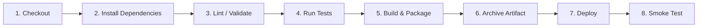

# Base64 Encoder / Decoder Web Application with Complete DevOps Pipeline

> **Academic DevOps Capstone Project**  
> **Author:** Veermaniyan.B  
> **Degree:** BE Computer Science Engineering  
> **Repository:** `base64-encoder-decoder-devops`  

---

## Executive Overview

This project is a high-performance, client-side **Base64 Encoder / Decoder Application** paired with a production-grade **DevOps CI/CD Automation Pipeline**. It demonstrates the complete software development lifecycle—from local Git feature branching to automated Jenkins building, linting, testing, packaging, artifact archiving, static web deployment, containerization with Docker/Nginx, and post-deployment smoke testing.

---

## Key Features

### 1. String Operations
- **Text Encoding:** Convert UTF-8 plain text (including Unicode characters like `Hello 世界`) into Base64 strings.
- **Text Decoding:** Convert Base64 strings back to clean plain text with input sanitization and padding validation.
- **Utility Actions:** Quick copy-to-clipboard, text swap, field clear, and sample data loading.

### 2. File Operations
- **File Encoding:** Upload text, images, PDFs, or binary documents up to 25MB via file picker or drag-and-drop.
- **Metadata Display:** Shows live file details: file name, file size (formatted in KB/MB), MIME type, and last modified timestamp.
- **File Decoding:** Convert raw Base64 data back into downloadable binary files with automatic MIME handling.

### 3. Client-Side Security & Privacy
- Zero backend data transmission—all operations execute entirely within the browser using DOM and Web APIs.
- Strict input validation prevents XSS and application crashes on corrupted Base64 strings.

---

## Technology Stack

| Domain | Technology / Tool |
| :--- | :--- |
| **Frontend UI** | HTML5, CSS3 (Modern Glassmorphism Design Tokens), JavaScript (ES6+) |
| **Browser Web APIs** | `TextEncoder`, `TextDecoder`, `FileReader`, `Blob`, `URL.createObjectURL` |
| **Version Control** | Git, GitHub |
| **CI/CD Automation** | Jenkins Automation Server (Declarative `Jenkinsfile`) |
| **Automated Testing** | Node.js Standard Test Runner (`node --test`), Custom Smoke Verification |
| **Containerization** | Docker, Nginx Alpine Server, Docker Compose |
| **Package Distribution**| Zip Compression (`base64-encoder-decoder-build.zip`) |

---

## Project Structure

```
Base64-DevOps/
├── src/
│   ├── index.html            # Main HTML5 application UI
│   ├── style.css             # Glassmorphism dark-mode stylesheet
│   └── script.js             # Base64 encoder/decoder & DOM controller
├── tests/
│   ├── unit.test.js          # Automated unit test suite (9 test cases)
│   └── smoke.test.js         # Post-deployment artifact verification
├── docs/
│   ├── architecture.md       # High-level system & pipeline architecture
│   ├── setup.md              # Local installation & Jenkins setup guide
│   ├── testing.md            # Test matrix and QA execution guide
│   └── deployment.md         # Nginx & Docker deployment guide
├── docker/
│   ├── Dockerfile            # Multi-stage Docker build config
│   └── nginx.conf            # Nginx web server & security headers config
├── Jenkinsfile               # 8-Stage Declarative CI/CD Pipeline
├── package.json              # NPM build, test, lint, & packaging scripts
├── docker-compose.yml        # One-click Docker container orchestration
├── .gitignore                # Version control exclusion list
└── README.md                 # Project documentation summary
```

---

## Git Branching Strategy

```
main (Production)
  └── develop (Integration)
        ├── feature/ui
        ├── feature/base64-encoding
        ├── feature/file-processing
        ├── feature/testing
        └── feature/ci-cd
```

- **`main`:** Contains production-verified release code.
- **`develop`:** Serves as the integration branch for merging completed features.
- **`feature/*`:** Isolated branches used for developing individual features.

---

## Jenkins 8-Stage CI/CD Pipeline Workflow



1. **Checkout:** Pulls latest code from Git branch.
2. **Install Dependencies:** Installs standard packages.
3. **Lint / Validate:** Validates JavaScript syntax correctness via `npm run lint`.
4. **Run Tests:** Executes 9 unit tests checking encode, decode, empty input, and Unicode compliance via `npm test`.
5. **Build & Package:** Copies assets to `dist/` and compresses into `base64-encoder-decoder-build.zip`.
6. **Archive Artifact:** Archives the deployable ZIP artifact inside Jenkins build history.
7. **Deploy:** Extracts package to production web server target folder (`./deploy_target`).
8. **Smoke Test:** Runs automated verification checks confirming artifact integrity.

---

## Quick Start Commands

### Local Execution
```powershell
# Install dependencies
npm install

# Run Unit Tests
npm test

# Run Smoke Tests
npm run smoke-test

# Build Production Dist & Package ZIP
npm run package

# Start Local Dev Server
npm start
```

### Docker Deployment
```powershell
# Build Docker Image
docker build -t base64-app:latest -f docker/Dockerfile .

# Run Docker Container
docker run -d -p 8080:80 --name base64_container base64-app:latest
```

---

## Author & Credits

- **Developer:** Veermaniyan.B
- **Project Type:** BE Computer Science Engineering DevOps Academic Project
