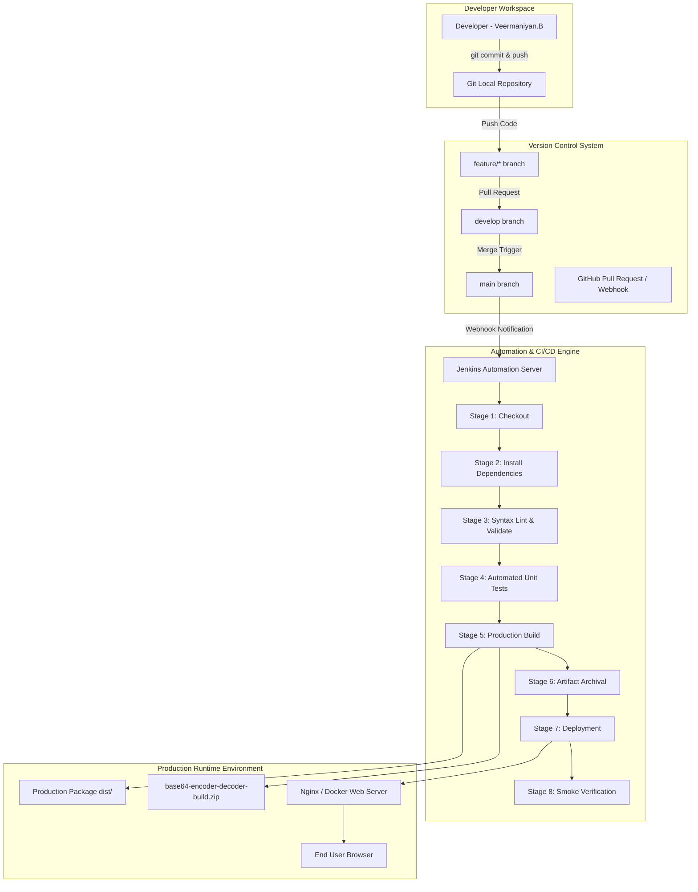

# Application & DevOps Architecture Document

**Project:** Base64 Encoder / Decoder Application with Complete DevOps CI/CD Pipeline  
**Author:** Veermaniyan.B  
**Institution:** BE Computer Science Engineering  

---

## 1. High-Level Architecture Overview

The system is structured as a zero-backend, client-side web application integrated with an automated DevOps pipeline leveraging **Git**, **GitHub**, **Jenkins**, **Node.js**, **Docker**, and **Nginx**.

---

## 2. Component Description

### 2.1 Web Application (Client-Side)
- **HTML5:** Semantic document structure, accessibility attributes, accessible form controls.
- **CSS3:** Responsive layout using CSS Flexbox/Grid, CSS custom variables (design tokens), glassmorphism aesthetic, pulse animations.
- **JavaScript (ES6+):** Pure client-side processing using `TextEncoder`/`TextDecoder` APIs for UTF-8 Unicode compliance, `FileReader` API for document encoding, and Blob/URL APIs for file decoding.

### 2.2 Version Control & Branching Strategy
- **`main`:** Production-ready code only.
- **`develop`:** Staging / integration branch for testing feature combinations.
- **`feature/*`:** Isolated branches for individual development tickets (e.g. `feature/ui`, `feature/file-processing`).

### 2.3 Automation & CI/CD Pipeline (Jenkins)
- **Declarative Jenkinsfile:** 8 distinct pipeline stages defining strict quality gates. Failure at any stage aborts execution immediately.
